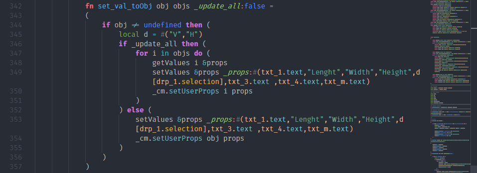

# MaxScript language support

Autodesk 3ds Max Scripting language (MaxScript) support.

## Features

- Syntax highlight.
- Code autocompletion; for keywords, primitives, generic functions, structDefs, interfaces and classes.
- Snippets for most used code blocks.
- Customized theme to match MaxScript elements diversity.
- Help command (*MaxScript help. Accessible from the right-click menu.*): Select a keyword and open related online documentation.




## Requirements

None.

## Extension Settings

None yet.

## Syntax Highlight

Default settings for **Custom highlighting**

```json
  /*
  * Syntax highlight options for language maxscript
  */
  "editor.tokenColorCustomizations": {
    "textMateRules": [
      {
        "name": "mxs comment",
        "scope": "comment.line.double-dash.maxscript, comment.block.maxscript",
        "settings": {
          "foreground": "#616161"
        }
      },
      {
        "name": "mxs name values",
        "scope": "punctuation.definition.name.begin.maxscript, punctuation.definition.name.unquoted.maxscript, string.other.name.maxscript",
        "settings": {
          "foreground": "#c678dd"
        }
      },
      {
        "name": "mxs verbatim string",
        "scope": "punctuation.definition.verbatim.string.begin.maxscript",
        "settings": {
          "foreground": "#78BEC2"
        }
      },
      {
        "name": "mxs hex value",
        "scope": "constant.other.hex.maxscript",
        "settings": {
          "foreground": "#E06B74"
        }
      },
      {
        "name": "mxs meta type",
        "scope": "entity.function.modifier.maxscript, entity.struct.type.maxscript, entity.function.type.maxscript",
        "settings": {
          "foreground": "#E06B74",
          "fontStyle": "bold"
        }
      },
      {
        "name": "msx meta name",
        "scope": "entity.function.name.maxscript, entity.struct.name.maxscript, entity.utility.name.maxscript",
        "settings": {
          "foreground": "#61AFEF"
        }
      },
      {
        "name": "mxs utility type",
        "scope": "entity.utility.type.maxscript",
        "settings": {
          "foreground": "#c678dd",
          "fontStyle": "bold"
        }
      },
      {
        "name": "mxs function call",
        "scope": "variable.parameter.maxscript",
        "settings": {
          "foreground": "#78BEC2"
        }
      },
      {
        "name": "mxs property member",
        "scope": "variable.property.maxscript",
        "settings": {
          "foreground": "#A46CCD"
        }
      },
      {
        "name": "mxs function parameter",
        "scope": "variable.other.name.maxscript",
        "settings": {
          "foreground": "#4C9FB2",
          "fontStyle": "italic"
        }
      },
      {
        "name": "mxs event declaration",
        "scope": "entity.event.type.maxscript, entity.event.keyword.maxscript",
        "settings": {
          "foreground": "#E06C75"
        }
      },
      {
        "name": "mxs event target",
        "scope": "entity.event.target.maxscript",
        "settings": {
          "foreground": "#E6B52E",
          "fontStyle": "italic"
        }
      },
      {
        "name": "mxs event action",
        "scope": "entity.event.action.maxscript",
        "settings": {
          "foreground": "#7EB33D"
        }
      },
      {
        "name": "mxs storage modifier",
        "scope": "storage.modifier.maxscript",
        "settings": {
          "foreground": "#7A9F4D"
        }
      },
      {
        "name": "mxs storage primitive",
        "scope": "storage.type.primitive.maxscript",
        "settings": {
          "foreground": "#477FB0"
        }
      },
      {
        "name": "mxs keyword operator",
        "scope": "keyword.operator.maxscript, keyword.operator.word.maxscript",
        "settings": {
          "foreground": "#78BEC2"
        }
      },
      {
        "name": "mxs keyword other",
        "scope": "keyword.other.maxscript",
        "settings": {
          "foreground": "#78C28E"
        }
      },
      {
        "name": "mxs keyword other",
        "scope": "keyword.reserved.maxscript",
        "settings": {
          "foreground": "#E6B52E",
          "fontStyle": "italic"
        }
      },
      {
        "name": "mxs byReference keyword",
        "scope": "punctuation.definition.byref.keyword.maxscript",
        "settings": {
          "foreground": "#7EB33D",
          "fontStyle": "italic"
        }
      },
      {
        "name": "mxs constant",
        "scope": "constant.language, variable.language.maxscript",
        "settings": {
          "foreground": "#528BFF"
        }
      },
      {
        "name": "mxs constant null",
        "scope": "constant.language.null.maxscript",
        "settings": {
          "foreground": "#C45968"
        }
      },
      {
        "name": "mxs array",
        "scope": "storage.type.array.maxscript, storage.type.bitarray.maxscript",
        "settings": {
          "foreground": "#E5CB82"
        }
      },
      {
        "name": "mxs array def",
        "scope": "keyword.definition.array.begin.maxscript",
        "settings": {
          "foreground": "#676a70"
        }
      },
      // support
      {
        "name": "mxs support objectset",
        "scope": "support.variable.ObjectSet.maxscript",
        "settings": {
          "foreground": "#E6B52E"
        }
      },
      {
        "name": "mxs support interface",
        "scope": "support.type.interface.maxscript",
        "settings": {
          "foreground": "#759FD1"
        }
      },
      {
        "name": "mxs support structDef",
        "scope": "support.type.StructDef.maxscript",
        "settings": {
          "foreground": "#59A7C8"
        }
      },
      {
        "name": "mxs support class",
        "scope": "support.class.maxscript, support.class.MAXSuperClass.maxscript,support.class.primitive.maxscript",
        "settings": {
          "foreground": "#A875D1"
        }
      },
      {
        "name": "mxs support primitive",
        "scope": " support.other.primitive.maxscript",
        "settings": {
          "foreground": "#61AFEF"
        }
      },
      {
        "name": "mxs support other",
        "scope": "support.constant.maxscript,support.type.generic.maxscript, support.variable.system.maxscript",
        "settings": {
          "foreground": "#CDA06C"
        }
      },
      {
        "name": "mxs rollout",
        "scope": "support.class.rollout-control.maxscript",
        "settings": {
          "foreground": "#E06C92"
        }
      },
      {
        "name": "msx definition variable",
        "scope": "punctuation.definition.variable.maxscript",
        "settings": {
          "foreground": "#E6B52E"
        }
      }
    ]
  },
```

## Executing MaxScript

MXSPyCOM project allow for editing & execution of 3ds Max MaxScript and Python files from external code editors.

- Get it here: [MXSPyCOM by Jeff Hannna](https://github.com/JeffHanna/MXSPyCOM)
- Follow the configuration guide to register the COM server.
- Set up a vscode task:

```json
{
    "version": "0.1.0",
    "command": "C:/MXSPyCOM/MXSPyCOM.exe",
    "isShellCommand": false,
    "args": ["-f"],
    "showOutput": "always",
    "tasks": [
        {
         "taskName": "Execute in Max",
         "args": ["${file}"],
         "suppressTaskName": true
        }
    ]
}
```

- run the task, enjoy the 3ds max listener throwing errors.

## Release Notes

[Changelog](./CHANGELOG.md)

Initial release.

## Contribute

[gitHub](https://github.com/HAG87/vscode-maxscript)

>Note: MaxScript Structure is to say at least, chaotic. I've done my best to organize structs, classes, interfaces and so on. However the grammar is usable enough.